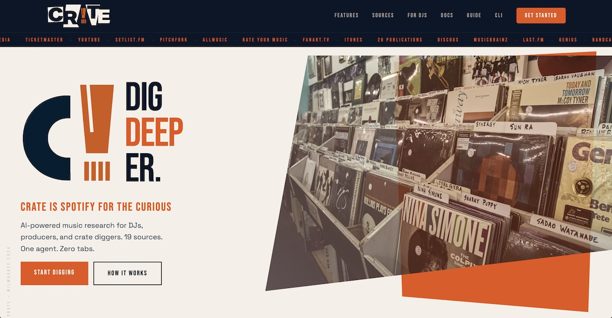

<p align="center">
  <a href="https://digcrate.app">
    
  </a>
</p>

<p align="center">
  AI-powered music research for DJs, producers, and crate diggers.<br />
  20+ sources. One agent. Zero tabs.
</p>

<p align="center">
  <a href="https://digcrate.app">Live App</a> &middot;
  <a href="https://digcrate.app/help">Help</a> &middot;
  <a href="https://github.com/tmoody1973/crate-cli">CLI</a> &middot;
  <a href="https://digcrate.app/pricing">Pricing</a>
</p>

<p align="center">
  
</p>

---

Crate is an AI music research workspace where an agent researches across Discogs, MusicBrainz, Last.fm, Genius, Bandcamp, WhoSampled, Wikipedia, Ticketmaster, Spotify, and more. Ask about any artist, track, sample, or genre and get back interactive components — not just text. Connect your Spotify, Slack, and Google accounts to act on what you find.

Built for the [Auth0 "Authorized to Act" Hackathon](https://auth0.devpost.com/).

## For Judges: Try It Live

The fastest way to evaluate Crate is on the live app — no install needed.

### Option A: Use the live app (recommended)

1. Go to **[digcrate.app](https://digcrate.app)**
2. Click **Get Started** and sign up (email or Google — free, no credit card)
3. Try these commands in the chat:
   - `/influence Flying Lotus` — traces influence connections across decades
   - `/artist MF DOOM` — full artist deep dive with discography and connections
   - `/spotify` — browse your Spotify playlists (requires connecting Spotify in Settings)
   - `/tumblr #jazz` — discover jazz posts across Tumblr
   - `/news` — daily music news segment
4. To see Token Vault in action: go to **Settings** (gear icon) → **Connected Services** → connect Spotify, Tumblr, Slack, or Google

### Option B: Run locally

```bash
git clone https://github.com/tmoody1973/crate-web.git
cd crate-web
npm install
cp .env.local.example .env.local
# Fill in required env vars (see Environment Variables below)
npx convex dev     # Terminal 1
npm run dev        # Terminal 2
```

Open [localhost:3000](http://localhost:3000). You'll need Clerk, Convex, and at minimum a `PLATFORM_ANTHROPIC_KEY` or your own Anthropic API key to use the agent.

### Demo video

[Watch the 3-minute demo](https://youtu.be/3hmwKvWDYJ4) showing Crate connecting to Spotify, Tumblr, Slack, and Google Docs through Auth0 Token Vault.

---

## Features

### Core research
- **Agentic research** — Claude-powered agent with tool-use across 20+ MCP data sources
- **Influence mapping** — `/influence [artist]` traces connections through review co-mentions, Last.fm similarity, and enriches via Perplexity with pull quotes, sonic elements, and key works
- **Show prep** — `/prep [station]: [setlist]` generates track context, talk breaks, social copy, and interview prep for radio DJs
- **Music news** — `/news [station] [count]` generates daily music news segments from RSS feeds and web search
- **Story cards** — `/story [topic]` creates rich narrative deep dives with chapters, YouTube embeds, key tracks, and people cards. Works for albums, artists, genres, labels, and events
- **Track deep dive** — `/track [song] [artist]` shows full credits (MusicBrainz + Discogs), samples (WhoSampled), lyrics (Genius), and vinyl pressings (Discogs) in a tabbed view. Crate's SongDNA competitor.
- **Artist profile** — `/artist [name]` renders a full artist deep dive with tabbed discography (playable albums), influence connections (tappable chips), media (YouTube + external links), and top tracks

### Connected services (Auth0 Token Vault)
- **Spotify** — Read your library, playlists, and top artists. Create new playlists from research. Export influence chains as playlists.
- **Tumblr** — Publish research to your blog. Discover music by tag across all of Tumblr. Blog selection for multi-blog accounts.
- **Slack** — Send research to any channel or DM with Block Kit formatting (headers, bullet lists, tables, dividers). Channel picker UI.
- **Google Docs** — Save research as shareable Google Docs

### Dynamic UI (OpenUI)
- **27+ interactive components** — Agent generates artist profiles, track deep dives, album grids, track lists with play buttons, influence chains with hero banners, show prep packages, story cards, Spotify playlist viewers, Slack channel pickers, and more at runtime
- **Deep Cuts panel** — Resizable split panel (desktop) or full-screen view (mobile) for viewing saved research. Dropdown selector with type-colored dots, publish to shareable links
- **Action buttons on every component** — Export to Spotify, Send to Slack, Publish, Deep Dive, Influence Map

### Custom skills
- **`/create-skill [description]`** — Teach Crate a new reusable command. Describe what you want, Crate does a dry run, saves it as a slash command
- **`/skills`** — List, enable/disable, edit, and delete your custom skills
- Free: 3 skills. Pro: 20 skills

### Subscription billing
- **Free tier** — 10 agent queries/month, 5 sessions, 3 custom skills, connected services, 20+ data sources
- **Pro ($15/mo)** — 50 queries, unlimited sessions, 20 skills, cross-session memory, influence caching, publishing
- **Team ($25/mo)** — 200 pooled queries, admin dashboard, shared org keys
- **BYOK** — Bring your own Anthropic or OpenRouter key for unlimited queries
- Stripe checkout, billing portal, webhook processing

### Mobile responsive
- **Full mobile UX** — Hamburger sidebar overlay, full-screen Deep Cuts with horizontal tabs, mini player bar, speech-to-text mic button
- **Touch optimized** — 44px+ touch targets, larger fonts, pill-shaped input
- **Capacitor ready** — designed to wrap for iOS App Store

### Publishing & sharing
- **Deep Cut publishing** — Click Publish on any research to get a shareable link at `digcrate.app/cuts/[id]`
- **Published Deep Cuts** — Render with audio player so anyone can listen
- **Telegraph/Tumblr** — Pro users can publish formatted articles with citations

### Other
- **Audio player** — Persistent bottom bar with YouTube playback (mini mode on mobile, hides on keyboard)
- **Live radio** — `/radio [genre/station]` streams any of 30,000+ stations
- **Multi-model** — Claude Sonnet 4.6, GPT-4o, Gemini 2.5, Llama 4, DeepSeek R1, Mistral Large via OpenRouter
- **Speech-to-text** — Mic button on mobile using Web Speech API
- **Keyboard shortcuts** — `Cmd+K` search, `Cmd+N` new chat, `Cmd+B` toggle sidebar, `Shift+S` settings

## Tech stack

| Layer | Technology | Purpose |
|-------|------------|---------|
| Framework | Next.js 16 (App Router) | SSR, API routes, Turbopack dev |
| Deployment | Vercel | Serverless functions |
| Auth | Clerk | User sign-in, OAuth |
| Connected services | Auth0 Token Vault | OAuth connections for Spotify, Tumblr, Slack, Google |
| Database | Convex | Real-time sessions, messages, playlists, collections, influence graph, subscriptions, skills, shares |
| Dynamic UI | OpenUI (`@openuidev/react-lang`) | Agent-generated interactive components |
| Agent | Anthropic SDK + agentic loop | Tool-use loop with crate-cli MCP servers |
| Billing | Stripe | Checkout, billing portal, webhooks |
| Styling | Tailwind CSS v4 | Dark theme, responsive mobile |
| Audio | YouTube IFrame API | Persistent player bar |
| Analytics | PostHog | Product analytics, LLM observability |
| Feedback | Canny | User feedback widget |

## Quick start

### Prerequisites

- Node.js 20+
- npm 10+
- [Clerk](https://clerk.com) account (free tier)
- [Convex](https://convex.dev) account (free tier)

### Install

```bash
git clone https://github.com/tmoody1973/crate-web.git
cd crate-web
npm install
```

### Environment variables

```bash
cp .env.local.example .env.local
```

Required:

```bash
# Clerk
NEXT_PUBLIC_CLERK_PUBLISHABLE_KEY=pk_...
CLERK_SECRET_KEY=sk_...
NEXT_PUBLIC_CLERK_SIGN_IN_URL=/sign-in
NEXT_PUBLIC_CLERK_SIGN_UP_URL=/sign-up

# Convex
NEXT_PUBLIC_CONVEX_URL=https://...convex.cloud
CONVEX_DEPLOYMENT=dev:...

# Encryption
ENCRYPTION_KEY=<64-char hex>

# Platform AI key (for free/pro users without BYOK)
PLATFORM_ANTHROPIC_KEY=sk-ant-...

# Admin
ADMIN_EMAILS=admin@example.com
```

Auth0 Token Vault (for connected services):

```bash
AUTH0_DOMAIN=your-tenant.us.auth0.com
AUTH0_CLIENT_ID=your-client-id
AUTH0_CLIENT_SECRET=your-client-secret
AUTH0_CALLBACK_URL=http://localhost:3000/api/auth0/callback
```

Stripe billing:

```bash
STRIPE_SECRET_KEY=sk_test_...
NEXT_PUBLIC_STRIPE_PUBLISHABLE_KEY=pk_test_...
STRIPE_WEBHOOK_SECRET=whsec_...
STRIPE_PRO_MONTHLY_PRICE_ID=price_...
STRIPE_PRO_ANNUAL_PRICE_ID=price_...
STRIPE_TEAM_MONTHLY_PRICE_ID=price_...
```

### Run

```bash
# Terminal 1 — Convex dev server
npx convex dev

# Terminal 2 — Next.js dev server
npm run dev
```

Open [localhost:3000](http://localhost:3000) and start digging.

## Project structure

```
crate-web/
├── convex/                              # Convex backend
│   ├── schema.ts                        # Database schema (13 tables)
│   ├── sessions.ts                      # Chat session CRUD
│   ├── messages.ts                      # Message persistence
│   ├── playlists.ts                     # Playlist management
│   ├── collection.ts                    # Vinyl collection
│   ├── influence.ts                     # Influence graph cache
│   ├── subscriptions.ts                 # Stripe subscription state
│   ├── usage.ts                         # Usage tracking + quotas
│   ├── userSkills.ts                    # Custom skill CRUD
│   ├── shares.ts                        # Published Deep Cut shares
│   ├── artifacts.ts                     # Saved research artifacts
│   └── users.ts                         # User sync (Clerk → Convex)
├── src/
│   ├── app/
│   │   ├── api/
│   │   │   ├── chat/route.ts            # SSE streaming — agentic loop
│   │   │   ├── auth0/                   # OAuth connect, callback, status, debug
│   │   │   ├── cuts/publish/            # Deep Cut publishing
│   │   │   ├── stripe/                  # Checkout, portal, webhooks
│   │   │   ├── skills/                  # Custom skill management
│   │   │   ├── keys/route.ts            # API key management
│   │   │   └── artwork/route.ts         # Spotify artwork proxy
│   │   ├── cuts/[shareId]/              # Public share page
│   │   ├── w/[sessionId]/              # Workspace (authenticated)
│   │   ├── pricing/                     # Pricing page
│   │   └── help/                        # Help guide
│   ├── components/
│   │   ├── chat/                        # Mobile header, mic, inline cards
│   │   ├── workspace/
│   │   │   ├── chat-panel.tsx           # Chat with OpenUI rendering
│   │   │   ├── deep-cuts-panel.tsx      # Resizable Deep Cuts panel
│   │   │   ├── mobile-deep-cuts.tsx     # Full-screen mobile Deep Cuts
│   │   │   └── workspace-shell.tsx      # Layout + mobile nav
│   │   ├── sidebar/                     # Desktop + mobile sidebar
│   │   ├── settings/                    # Connected services, plan, skills, keys
│   │   ├── player/                      # YouTube audio player
│   │   ├── onboarding/                  # Quick start wizard
│   │   └── landing/                     # Landing page sections
│   ├── hooks/
│   │   ├── use-is-mobile.ts            # SSR-safe mobile breakpoint
│   │   └── use-keyboard-visible.ts     # iOS keyboard detection
│   └── lib/
│       ├── openui/
│       │   ├── components.tsx           # 27+ OpenUI component definitions
│       │   ├── library.ts              # Component registry + examples
│       │   └── prompt.ts               # System prompt for agent → OpenUI
│       ├── web-tools/
│       │   ├── spotify-connected.ts    # Read library, create playlists, read tracks
│       │   ├── slack.ts                # List channels, send messages
│       │   ├── slack-formatter.ts      # Block Kit rich text formatting
│       │   ├── google-docs.ts          # Save to Google Docs
│       │   ├── tumblr-connected.ts    # Read dashboard/tags/likes, publish posts
│       │   ├── user-skills.ts          # Custom skill tools
│       │   ├── prep-research.ts        # Perplexity-powered research
│       │   └── ...                     # WhoSampled, Bandcamp, radio, etc.
│       ├── auth0-token-vault.ts        # OAuth token exchange via Management API
│       ├── agentic-loop.ts             # Agentic loop (Anthropic + OpenRouter)
│       ├── plans.ts                    # Subscription tiers, rate limiting
│       ├── deep-cut-utils.ts           # Type detection, colors, actions
│       └── chat-utils.ts              # Slash commands, prompt routing
└── docs/
    ├── storycard-guide.md              # StoryCard component guide
    ├── testing-guide.md                # Feature testing checklist
    ├── articles/                       # LinkedIn, blog posts
    └── superpowers/                    # Design specs + plans
```

## OpenUI components

| Component | Purpose |
|-----------|---------|
| ArtistProfile | Full artist deep dive — tabbed discography, connections, media, top tracks |
| ArtistCard | Compact baseball-card artist profiles with auto-fetched images |
| TrackCard | Single-track deep dive — tabbed credits, samples, lyrics, vinyl pressings |
| InfluenceChain | Narrative influence timeline with hero banner, tabs, source cards |
| StoryCard | Rich narrative stories with chapters, YouTube, tracks, key people |
| ShowPrepPackage | Full show prep with track context, talk breaks, social copy |
| TrackList | Playable playlist with auto-save and AI-generated cover art |
| SpotifyPlaylists | Spotify library browser with Explore/Open buttons |
| SpotifyPlaylist | Track table from a Spotify playlist with action buttons |
| SlackChannelPicker | Clickable channel grid for sending to Slack |
| SlackMessage | Slack message preview with send status |
| TumblrFeed | Tumblr posts by tag, dashboard, or likes with type filters |
| AlbumGrid | Discography display with cover art |
| SampleTree | Sample relationship visualization |
| ConcertList | Event listings with venue, date, price |

## Auth0 Token Vault integration

Crate uses Auth0 Token Vault to securely connect to four third-party services on behalf of users. The architecture:

1. **Clerk** handles user sign-in (existing auth)
2. **Auth0** handles OAuth connections to Spotify, Tumblr, Slack, Google
3. Token Vault stores and manages OAuth tokens — Crate never sees raw credentials
4. The Management API retrieves IdP access tokens at runtime

### Supported services

| Service | OAuth Scopes | What the Agent Does |
|---------|-------------|-------------------|
| Spotify | `user-library-read`, `playlist-modify-public`, `streaming` | Read library, export playlists, stream tracks |
| Tumblr | `basic`, `write`, `offline_access` | Publish research, discover music by tag |
| Slack | `chat:write`, `chat:write.public`, `channels:read` | Send show prep to team channels |
| Google Docs | `documents`, `drive.file` | Save research as permanent documents |

### Connection flow

```
User clicks "Connect Spotify" in Settings
  → /api/auth0/connect?service=spotify (generates CSRF nonce, redirects to Auth0)
  → Auth0 /authorize (user grants permissions)
  → /api/auth0/callback (exchanges code, extracts Auth0 user ID, sets cookies)
  → Redirects back to current session
```

### Token retrieval

```
Agent calls read_spotify_library tool
  → getTokenVaultToken("spotify", auth0UserId)
  → Gets Management API token (cached 23h)
  → Calls /api/v2/users/{userId}?fields=identities
  → Returns access_token from the spotify identity
  → Tool uses token to call Spotify Web API
```

## Data sources

| Source | Data |
|--------|------|
| Discogs | Releases, labels, credits, cover art |
| MusicBrainz | Artist metadata, relationships, recordings |
| Last.fm | Similar artists, tags, listening stats |
| Genius | Lyrics, annotations, song metadata |
| Bandcamp | Album search, tag exploration, related tags |
| WhoSampled | Sample origins, covers, remixes |
| Wikipedia | Artist bios, discography context |
| Ticketmaster | Concert listings, ticket availability |
| Spotify | Library, playlists, top artists (via Auth0) |
| fanart.tv | HD artist backgrounds, logos |
| iTunes | Album artwork, track search |
| YouTube | Music videos, documentaries |
| Exa.ai | Semantic web search |
| Tavily | AI-optimized web search |
| Perplexity (Sonar) | Research enrichment with citations |
| Mem0 | Cross-session user memory (Pro) |
| Radio Browser | 30,000+ live radio stations |

## Deploy

```bash
npm i -g vercel
vercel --prod
npx convex deploy --yes
```

Set all environment variables in Vercel dashboard.

## Related

- [Crate CLI](https://github.com/tmoody1973/crate-cli) — Terminal-based AI music research agent
- [OpenUI](https://github.com/thesysdev/openui) — Dynamic UI generation framework
- [Auth0 Token Vault](https://auth0.com/ai/docs/intro/token-vault) — Secure token exchange for AI agents
- [Convex](https://convex.dev) — Real-time database

## Legal

- [Privacy Policy](https://digcrate.app/privacy)
- [Terms of Service](https://digcrate.app/terms)

## License

MIT
